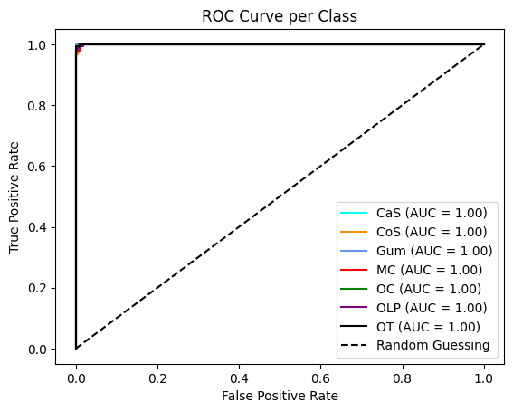

# Mouth and Oral Disease Classification using InceptionResNetV2

This project is a **Deep Learning** implementation for classifying 7 types of mouth and oral diseases using the **InceptionResNetV2** model. The project is based on the scientific paper "Mouth and oral disease classification using InceptionResNetV2 method". The model achieves exceptionally high accuracy, demonstrating significant potential for assisting in medical diagnosis.

## 📂 Repository Structure

Below is the structure of this repository:

```
.
├── .ipynb_checkpoints/
├── Image/                  # Contains images for testing the model's predictions
├── Teeth_Dataset/          # The organized dataset folder
│   ├── Training/
│   ├── Validation/
│   └── Testing/
├── Mouth_and_Oral_Diseases_(MOD).ipynb  # The main notebook with all the source code
├── README.md
├── Teeth_Dataset-20250624T164231Z-1-001.zip # The original zipped dataset
└── inceptionresnetv2_teeth.pth          # The trained model weights
```

## 📝 Project Overview

The goal of this project is to build an automated system capable of accurately classifying 7 distinct oral diseases from clinical images. The core technique is **Transfer Learning**, utilizing the InceptionResNetV2 model pre-trained on the ImageNet dataset.

The diseases targeted for classification are:

1.  **CaS** (Canker Sores)
2.  **CoS** (Cold Sores)
3.  **Gum** (Gangivostomatitis)
4.  **MC** (Mouth Cancer)
5.  **OC** (Oral Cancer)
6.  **OLP** (Oral Lichen Planus)
7.  **OT** (Oral Thrush)

## 🗂️ Dataset

This project uses the custom **"Mouth and Oral Diseases" (MOD)** dataset, which was created by the authors of the research paper.

- **Origin:** The data was collected from dental clinics in Okara, Punjab, Pakistan, and supplemented with images from online sources.
- **Size:** The original dataset contains 517 image samples. To improve performance and prevent overfitting, **Data Augmentation** techniques were applied, expanding the dataset to **5,143 images** for training and evaluation.
- **Split:** The data is divided into a 60% training set, 20% validation set, and 20% testing set.

## 🤖 Model and Training

- **Architecture:** The powerful **InceptionResNetV2** CNN is used as the base model.
- **Transfer Learning:** The model's final classification layer was replaced with a new layer containing 7 outputs to match the project's requirements.
- **Training:** The model was trained for 50 epochs using the Adam optimizer and Cross-Entropy Loss function.

## 📊 Results

The model's performance was rigorously evaluated on the held-out test set. The results demonstrate the model's exceptional accuracy and reliability in classifying oral diseases.

### Training & Validation Curves


- **Accuracy:** Both training and validation accuracies rise quickly and stabilize at a very high level, indicating effective learning.
- **Loss:** Correspondingly, the loss for both sets decreases significantly and remains low.
- **Generalization:** The close tracking between the training and validation curves suggests that the model generalizes well to new, unseen data without significant overfitting.

### Confusion Matrix


- **Interpretation:** The high values along the diagonal represent the number of correctly classified images for each class. The off-diagonal values are minimal, indicating very few misclassifications. For instance, the model correctly identified 120 instances of "Gum" and 175 instances of "MC".

### ROC Curve & AUC Score



- **Performance:** An AUC score of 1.0 represents a perfect classifier. The model achieves an AUC of 1.00 for nearly every class, which signifies outstanding and near-perfect classification performance on the test data.

### Overall Accuracy

The proposed InceptionResNetV2 model achieved a final accuracy of **99.51%** on the test set.

## 🛠️ Technology Stack

- Python 3.x
- PyTorch
- Torchvision
- Pretrained-models-pytorch
- Scikit-learn
- Pandas & NumPy
- Matplotlib

## 🚀 Installation and Usage Guide

1.  **Clone this repository:**

    ```bash
    git clone [https://github.com/your-username/your-repository-name.git](https://github.com/your-username/your-repository-name.git)
    cd your-repository-name
    ```

2.  **Create a virtual environment and install dependencies:**

    ```bash
    python -m venv venv
    source venv/bin/activate  # On Windows: venv\Scripts\activate
    ```

3.  **Prepare the dataset:**

    - Unzip the `Teeth_Dataset-20250624T164231Z-1-001.zip` file.
    - Ensure the `Teeth_Dataset/` directory contains the three subfolders: `Training/`, `Validation/`, and `Testing/`.

4.  **Run the Notebook:**
    - Open the `Mouth_and_Oral_Diseases_(MOD).ipynb` file in Jupyter Notebook or Google Colab.
    - Execute the cells in order to retrain the model or use the provided `inceptionresnetv2_teeth.pth` weights file to perform evaluation and prediction.

## 🖼️ Prediction on New Images

Here are some examples of the model's predictions on new images from the `Image/` folder. This demonstrates the model's effectiveness in classifying unseen data.


## 📜 Citation

If you use the code or methods from this project, please cite the original paper:
[Rashid, J., Qaisar, B.S., Riaz ul Amin, M.F. et al. Mouth and oral disease classification using InceptionResNetV2 method. Multimed Tools Appl 83, 33903–33921 (2024)](https://doi.org/10.1007/s11042-023-16776-x)

## 🙏 Acknowledgements

I would like to extend my sincere gratitude to the authors of the research paper for their valuable work and for making the dataset publicly available. This project would not have been possible without their contribution to the field.
